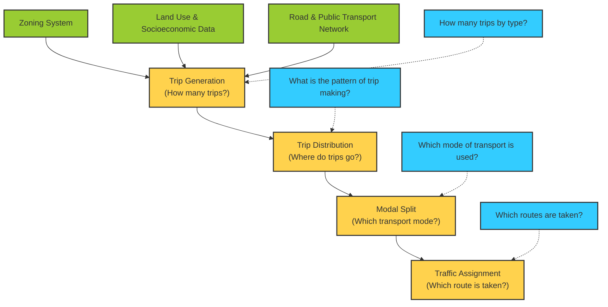

# Comprehensive Mobility Plan for Chandigarh Tri-City Complex
*Updated Draft CMP — 2052 Horizon*

## Table of Contents
- [Executive Summary](#executive-summary)
- [Background and Need of Study](#background-and-need-of-study)
- [Study Area and Objectives](#study-area-and-objectives)
- [Land Use and Socioeconomic Characteristics](#land-use-and-socioeconomic-characteristics)
- [Major Components of the Comprehensive Mobility Plan](#major-components-of-the-comprehensive-mobility-plan)
- [Transport Demand Modelling and Forecasting](#transport-demand-modelling-and-forecasting)
- [Proposed Integrated Mass Transport System](#proposed-integrated-mass-transport-system)
- [Conclusion and Recommendations](#conclusion-and-recommendations)

## Executive Summary
The Chandigarh Tri-City Complex, comprising Chandigarh, Mohali (SAS Nagar), and Panchkula, along with neighboring growth nodes like Zirakpur, Kharar, and New Chandigarh, is experiencing rapid urbanization and unprecedented vehicular growth. To prevent severe traffic congestion, reduce environmental degradation, and support sustainable economic expansion, a long-term transportation framework has been developed. 

Commissioned by the Chandigarh Administration and drafted by RITES Ltd., this Comprehensive Mobility Plan (CMP) details strategic short-term, medium-term, and long-term interventions up to the horizon year 2052. The cornerstone of the plan is an integrated, multi-modal Mass Rapid Transit System (MRTS), complemented by non-motorized transport (NMT) infrastructure, bus system upgrades, and modern traffic management systems.

## Background and Need of Study
The unique layout of Chandigarh, originally designed by Le Corbusier as a low-rise, aesthetic, and grid-planned administrative city, has experienced high levels of private vehicle ownership. As the highest per-capita income region in India, the Tri-City's vehicle population is rising exponentially. 

In addition, suburban nodes such as Zirakpur, Kharar, and New Chandigarh (in Punjab) and Pinjore, Kalka, and Alipur (in Haryana) have high daily traffic interaction with Chandigarh's core. In the absence of high-capacity, high-frequency public transportation, commuter reliance on personalized vehicles has led to gridlock at key junctions, declining air quality, and economic productivity losses. To solve these regional challenges, RITES Ltd. was engaged to prepare a comprehensive mobility vision extending through 2052.

## Study Area and Objectives
The study area covers the entire metropolitan region of approximately **505 Sq Km**, encompassing:
*   **Union Territory:** Chandigarh
*   **Punjab Nodes:** SAS Nagar (Mohali), Kharar, New Chandigarh, and Zirakpur
*   **Haryana Nodes:** Panchkula

### Key Objectives
*   **Long-Term Mobility Strategy:** Establish a robust regional transit network that prevents piecemeal, reactive infrastructure solutions.
*   **Promote Sustainable Modes:** Increase public transit ridership and support Non-Motorized Transport (NMT) such as dedicated cycling lanes and pedestrian walkways.
*   **Integrated Land Use & Transport:** Co-align transit corridors with high-density transit-oriented development (TOD) zones.
*   **National Urban Transport Policy (NUTP) Compliance:** Adhere to federal guidelines prioritizing public transit and environmental sustainability.
*   **Investment Optimization:** Ensure cost-effective capital allocation across transit modes.

## Land Use and Socioeconomic Characteristics
Demographic projections indicate that the Tri-City population will grow from **24.5 Lakh in 2022 to 46.4 Lakh by 2052**. Similarly, employment opportunities are expected to rise to support this expanding population base. 

The projected population and employment figures prepared by RITES Ltd. are summarized in Table 0.1 below:

### Table 0.1: Projected Population & Employment of Chandigarh Tri-City and Nearby Towns
| Year | Population (Lakh) | Employment (Lakh) | Source |
| :--- | :--- | :--- | :--- |
| **2022** (Base Year) | 24.5 | 9.73 | Master Plan Projections |
| **2032** | 30.4 | 12.02 | Regression Modelling |
| **2042** | 38.5 | 15.32 | Regression Modelling |
| **2052** (Horizon Year) | 46.4 | 18.58 | Regression Modelling |

High employment density is concentrated in Chandigarh's commercial sectors (e.g., Sector 17, Sector 34) and Mohali's IT industrial sectors. Developing an extensive mass transit system is critical to linking these residential suburbs to commercial nodes.

## Major Components of the Comprehensive Mobility Plan
The CMP integrates multiple infrastructural and system initiatives:
1.  **Mass Rapid Transit System (MRTS):** Core trunk corridors to provide high-capacity passenger transport across the states.
2.  **Dedicated Bus Corridors:** A medium-level transit system feeding the main MRTS network.
3.  **Feeder and City Bus Upgrades:** Expansion of the Chandigarh Transport Undertaking (CTU) fleet.
4.  **Pedestrian Facilities:** Elevated footbridges, underpasses, and continuous footpaths.
5.  **V-8 Grid Road Networks:** Dedicated cycling and pedestrian lanes matching Chandigarh's Master Plan grid layout.
6.  **Bypasses and Peripheral Hubs:** Diverting interstate freight traffic via bypass routes and peripheral transport hubs.
7.  **Junction Improvements:** Traffic System Management (TSM) interventions like grade separation (underpasses/overpasses) and channelization at high-traffic roundabouts.

## Transport Demand Modelling and Forecasting
To forecast traffic flows and plan routes, a traditional 4-stage Urban Transport Planning System (UTPS) model was implemented, combining zoning systems, socioeconomic profiles, and transport networks.

### Figure 0.2: Four Stage Model Structure

### Future Scenarios Analysed (2052)
*   **Business As Usual (BAU) Scenario:** Assumes private vehicle ownership trends continue unchecked. Public transport modal share is expected to decline or plateau around 22%, resulting in severe gridlock and failure of major intersection levels of service.
*   **Sustainable Urban Transport (SUT) Scenario:** Prioritizes public transit investments and NMT. The goal is to elevate public transit modal split significantly, minimizing CO2 emissions and ensuring a sustainable, livable urban ecosystem.

## Proposed Integrated Mass Transport System
The proposed MRTS network consists of two primary implementation phases to connect major nodes inside and outside Chandigarh.

### Phase I (Target: 2037)
Comprises three corridors totaling approximately **77 - 91 km**:
*   **Line 1 (Paroul to Panchkula Sector 28):** Connects New Chandigarh (Punjab) to Panchkula (Haryana) via Chandigarh's central grid (32.2 km).
*   **Line 2 (Sukhna Lake to Zirakpur ISBT):** Connects Chandigarh's north to Zirakpur in the south via Mohali ISBT and Chandigarh Airport (36.4 km).
*   **Line 3 (Grain Market Chowk to Transport Chowk):** Lateral corridor linking Sector 39 to Sector 26 (13.8 km).

### Phase II (Horizon: 2052)
Extends the Phase I network to outer satellite towns:
*   Extensions from Zirakpur ISBT to Pinjore ISBT / Kalka.
*   Extensions within Mohali (Airport Chowk to Manakpur Kallar).

## Conclusion and Recommendations
The Comprehensive Mobility Plan (CMP) represents a critical blueprint for the future of the Chandigarh Tri-City Complex. To ensure successful execution, it is recommended to:
1.  **Establish the Unified Metropolitan Transport Authority (UMTA):** Create a single statutory body to coordinate transit planning, fare integration, and operations between Punjab, Haryana, and the Chandigarh Administration.
2.  **Fast-Track Phase I Corridor Clearances:** Secure immediate approvals from Punjab and Haryana state cabinets and the Ministry of Housing and Urban Affairs (MoHUA) to commence civil works.
3.  **Implement Transit-Oriented Development (TOD):** Revise zoning bylaws to allow higher floor area ratios (FAR) along proposed metro lines to encourage ridership.
4.  **Invest in First/Last-Mile Connectivity:** Deploy electric feeder bus services, micro-mobility options (e-scooters, bicycle sharing), and build continuous, well-lit pedestrian pathways.
